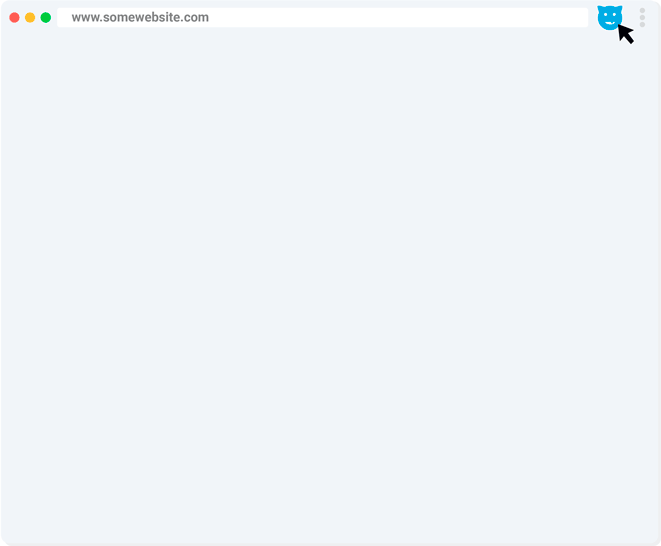
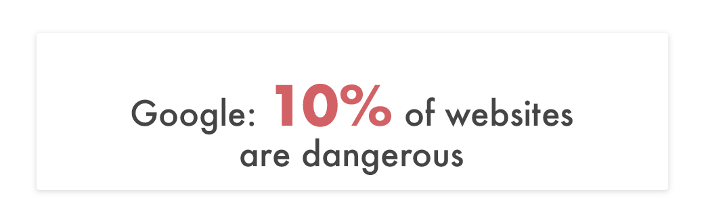
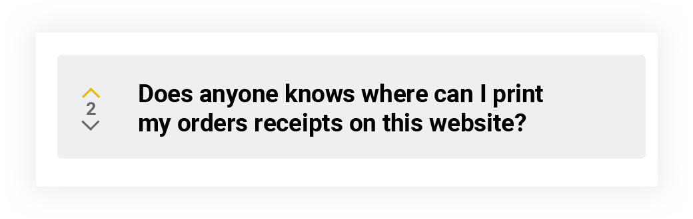
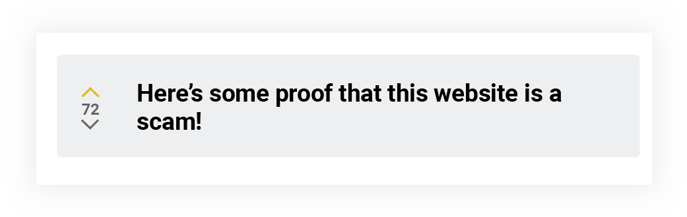
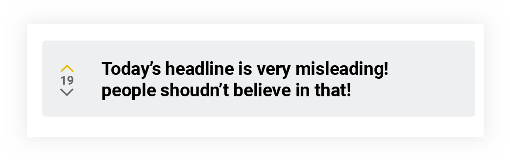

<!DOCTYPE html>
<html lang="en">
  <head>
    <meta charset="utf-8" />
    <meta http-equiv="X-UA-Compatible" content="IE=edge" />
    <meta name="viewport" content="width=device-width,initial-scale=1" />
    <meta property="og:url" content="https://joinvitri.com/" />
    <meta
      property="og:title"
      content="Transform every website into a community"
    />
    <meta
      name="og:description"
      content="A free browser extension that brings social interactions to websites."
    />
    <meta property="og:site_name" content="vitri" />
    <meta property="og:image" content="images/home/social.png" />
    <meta property="og:type" content="website" />
    <meta name="robots" content="noodp" />
    <meta name="twitter:card" content="summary_large_image" />
    <meta name="twitter:site" content="@joinvitri" />
    <meta
      property="twitter:title"
      content="Vitri - Transform websites into communities"
    />
    <meta name="twitter:creator" content="@joinvitri" />
    <meta
      name="twitter:description"
      content="A free browser extension that brings social interactions to websites."
    />
    <meta
      name="twitter:image"
      content="https://joinvitri.com/images/home/social.png"
    />
    <meta itemprop="name" content="Vitri - Freedom of speech for every website" />
    <meta
      itemprop="description"
      content="A free browser extension that brings social interactions to websites."
    />
    <meta
      itemprop="image"
      content="https://joinvitri.com/images/home/social.png"
    />
    <title>Transform every website into a community</title>
    <link href="css/bootstrap.min.css" rel="stylesheet" />
    <link href="css/home.main.css" rel="stylesheet" />
   
    <link
      rel="apple-touch-icon"
      sizes="72x72"
      href="fav/icon-72x72.png"
    />
    <link
      rel="apple-touch-icon"
      sizes="144x144"
      href="fav/icon-144x144.png"
    />
    <link
      rel="apple-touch-icon"
      sizes="152x152"
      href="fav/icon-152x152.png"
    />
    <link
      rel="icon"
      type="image/png"
      sizes="192x192"
      href="fav/icon-192x192.png"
    />
    <link
      rel="icon"
      type="image/png"
      sizes="32x32"
      href="fav/favicon-32x32.png"
    />
    <link
      rel="icon"
      type="image/png"
      sizes="96x96"
      href="fav/favicon-96x96.png"
    />
    <link
      rel="icon"
      type="image/png"
      sizes="16x16"
      href="fav/favicon-16x16.png"
    />
    <link rel="manifest" href="fav/manifest.json" />
    <meta name="msapplication-TileColor" content="#ffffff" />
    <meta name="msapplication-TileImage" content="fav/ms-icon-144x144.png" />
    <meta name="theme-color" content="#ffffff" />
    <link href="../fonts.googleapis.com/css.css" rel="stylesheet" />
    <link
      rel="chrome-webstore-item"
      href="https://chrome.google.com/webstore/detail/fokjpjpcpeaoclehaonohenhcdpmmjmp"
    />
    <!--[if lt IE 9]>
      
      
    <![endif]-->
  </head>
  <body style="display: none;">
    <nav class="navbar navbar-default home-header">
      

        

          

            

            

            

          

          
        

        
      

    </nav>
    

      

        <h1 class="hero-head">
          Discover on the web
        </h1>
        

          A free browser extension that transforms every website into a community.
        

        

          <button style="background-color: #29ABE2" class="whatruns-btn p-relative">
            Add to Chrome
          </button>
        

      

    

    

      

        
      

      

        

          
        

         

          Unveil and share experiences
        

        

          To find a website community on Vitri is very simple. Just click our chrome extension popup, you will be prompted with recent posts for that website.
        
 
      

      
    

    

      

        

           

          Can I trust this website?
        

        

          The web has come a long way since the 90's, 
          but in many cases we still only see the website owner's perspective, that many
          times are fake and staged to scam people.
        
 
        

        

          

            
          

          

            
          

        

      

    

    

      

        

          

            
          

          

            
          

          

            
          

        

        

          

            Your favorite website is now a community
          

          

            Anything that could generate a discussion now can be shared and addressed by the website's users and without the website's owner interference.
          

          
        

      

    

    

      <h1 class="pg-title p-lr-20">
        Vitri is free and without ads! 😀
      </h1>
      

        We currently maintain Vitri with donations
         
        <a href="https://www.patreon.com/bePatron?u=36748855">Become a Patron!</a>
      

      
      

    

    

      AS SEEN IN
      
    

    

      <h1 class="pg-title">Join Vitri community.</h1>
      

        

          Install and press the magic button.
        

        

          <button style="background-color: #29ABE2" class="whatruns-btn p-relative">
            Add to Chrome
          </button>
        

      

    

    

      

        

          

            

              
            

            

              
              <ul class="p-0">
                <li>
                  <a
                    class="pg-small-text"
                    href="https://twitter.com/joinvitri"
                    target="_blank"
                    >Twitter</a
                  >
                </li>
                <li>
                  
contact@joinvitri.com

                </li>
              </ul>
            

            

            

          

          

            

              

                Copyright @ joinvitri.com 2020. All Rights Reserved.
              

            

          

        

      

    

    
    
    
    
    
    
    
    
    <!-- Global site tag (gtag.js) - Google Analytics -->

   
  </body>
</html>
